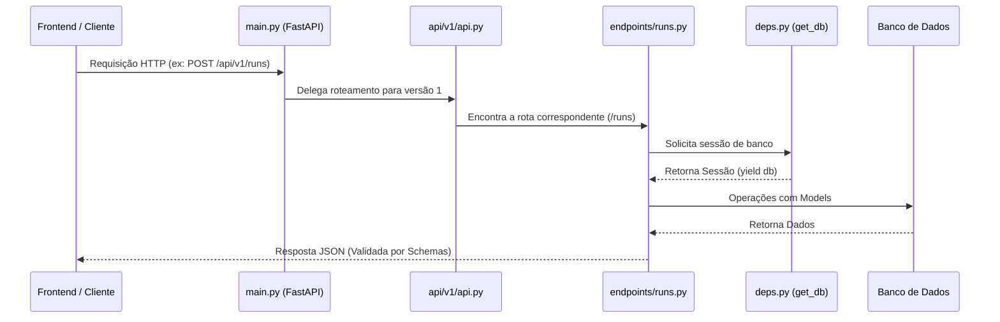

# Arquitetura e Fluxo da API

Este documento detalha o funcionamento e a organização da API construída com FastAPI no diretório `backend/app`. A estrutura segue um padrão modular altamente escalável, dividindo claramente as responsabilidades de negócio, banco de dados, e comunicação HTTP.

## Fluxo Geral de uma Requisição

Quando uma requisição chega do frontend para o backend, ela segue este caminho:

1.  O servidor é inicializado através do arquivo principal (`main.py`).
2.  Uma requisição do usuário é interceptada e passa pelos middlewares (como o CORS).
3.  O roteador central (`api/v1/api.py`) direciona a requisição para o endpoint correto.
4.  O endpoint, que depende de uma conexão com o banco (fornecida via injenção de dependência pelo `deps.py`), aciona a lógica necessária e responde ao cliente.

---

## Responsabilidade dos Diretórios e Arquivos Principais

### O Ponto de Partida

- **[`main.py`](file:///Users/klebervasconcelos/Documents/TCC/sketch-1/backend/app/main.py)**
  É a raiz da sua aplicação FastAPI.
  - **Responsabilidades:** Instanciar o aplicativo `FastAPI`, configurar middlewares (como o `CORSMiddleware` para permitir o acesso do frontend), garantir que as tabelas do banco de dados sejam inicializadas na partida, e registrar o roteador principal da API.

### Diretório `api/` (Roteamento e Dependências)

Concentra tudo relacionado a rotas HTTP e como a requisição se comunica com a camada de dados.

- **[`deps.py`](file:///Users/klebervasconcelos/Documents/TCC/sketch-1/backend/app/api/deps.py)**
  - **Responsabilidade:** Fornecer injeções de dependência (`Dependency Injection`).
  - **Exemplo Prático:** A função `get_db()` abre uma sessão com o banco, entrega para a rota que a solicitou (usando a instrução `yield`) e, após o término da requisição, cuida de fechar a conexão de forma segura.
- **`v1/`**
  Organiza os arquivos de rotas da versão 1. Isso garante que atualizações futuras na API (v2) não quebrem sistemas antigos.
  - **[`api.py`](file:///Users/klebervasconcelos/Documents/TCC/sketch-1/backend/app/api/v1/api.py)**: Age como um aglutinador. Ele importa todos os mini-roteadores da pasta `endpoints` e os centraliza no `api_router` da v1.
  - **`endpoints/`**: Contém os arquivos que definem as URLs reais.
    - **`runs.py`**: Detém as funções que lidam com requisições para a entidade "runs" (ex: `@router.get("/")`, `@router.post("/")`). Ele recebe o JSON de entrada, delega tarefas aos serviços ou banco, e devolve o JSON de saída.

### Outros Diretórios de Suporte à API

Para manter os endpoints enxutos e organizados, a lógica interna é delegada a estas outras pastas:

- **`core/`**
  Gerencia configurações e metadados globais, como strings de conexão e chaves secretas. Ex: `config.py`.
- **`models/`**
  Armazena os modelos ORM do _SQLAlchemy_.
  - **Responsabilidade:** Descrever exatamente as tabelas do banco de dados em formato Python. O banco "entende" essas classes.
- **`schemas/`**
  Armazena os esquemas de dados do _Pydantic_.
  - **Responsabilidade:** Validar dados de entrada e saída. Se o frontend enviar uma requisição faltando um dado essencial, é o _Pydantic_ que retornará um erro automático 422 (Unprocessable Entity).
- **`db/`**
  Contém a lógica de estabelecimento da conexão inicial (`session.py`) e da classe Base para criar as tabelas.
- **`services/`** _(Regra de Negócio)_
  - **Responsabilidade:** Isolar cálculos ou lógica de processamento do endpoint da API. Se a requisição demandar uma matemática complexa, não deve estar no arquivo de endpoint (`runs.py`), mas sim em um serviço correspondente.
